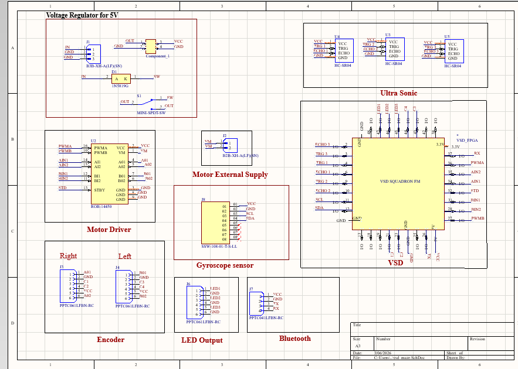

# VSD Squadron School Version - Micromouse Robot

This project features a maze-solving robot built using the **VSD Squadron FM FPGA** board. It includes complete RTL design, PCB schematics, and hardware implementation details.

## Project Overview
The robot uses ultrasonic sensors for navigation and a UART interface for telemetry. The core logic is implemented in Verilog and deployed on the VSD Squadron FM FPGA.

### Key Features
- **FPGA-Based Control**: Powered by VSD Squadron FM.
- **Obstacle Avoidance**: Uses HC-SR04 ultrasonic sensors.
- **Motor Control**: Dual motor driver integration.
- **Telemetry**: Real-time data transmission via UART.

---

## Hardware Design

### PCB Schematics
The design includes custom PCB layouts for the robot's mainboard.

### Layout & 3D View
| 2D Layout | 3D Visualization |
| :---: | :---: |
|  |  |

### Fabricated Robot
Below are the photos of the assembled and fabricated robot:
| Front View | Back View |
| :---: | :---: |
|  |  |

---

## RTL Design (Verilog)

The source code is located in the `rtl/` directory.

### 1. UART Module (`uart_trx.v`)
- Implements an **8N1 UART transmitter**.
- Operates at 9600 baud (when provided with the appropriate clock).
- Features a state machine for IDLE, START, TXING, and DONE states.

### 2. Ultrasonic Sensor Module (`ultra_sonic_sensor.v`)
- Manages the **HC-SR04** sensor.
- Generates the 10µs trigger pulse.
- Measures the echo pulse width and converts it to distance in centimeters.
- Includes a `refresher` module for periodic measurements (every 50ms/250ms).

### 3. Pin Constraints (`VSDSquadronFM.pcf`)
- Maps the Verilog signals to the physical pins of the VSD Squadron FM board.
- Includes mappings for Motors (AIN/BIN), Sensors (Trig/Echo), and UART.

---

## Demonstrations

### Maze Solving Performance
Watch the robot navigate through a maze:

https://github.com/gowthamnow/VSD_SQUADRON_SCHOOL_VERSION/assets/media/mazefirst.mp4

https://github.com/gowthamnow/VSD_SQUADRON_SCHOOL_VERSION/assets/media/maze2.mp4

*(Note: GitHub supports direct video playback for MP4 files in the repository.)*

---

## About VSD Squadron FM
The **VSD Squadron FM** is a versatile FPGA development board designed for educational and professional applications. It provides a robust platform for learning RTL design and building complex embedded systems.

## Getting Started
1. **Hardware**: Refer to `hardware/` for schematics and PCB design files.
2. **Software**: Use the Verilog files in `rtl/` with your preferred FPGA synthesis tool (e.g., iCEcube2 or open-source tools like Yosys/Nextpnr).
3. **Constraints**: Apply `VSDSquadronFM.pcf` for pin mapping.
