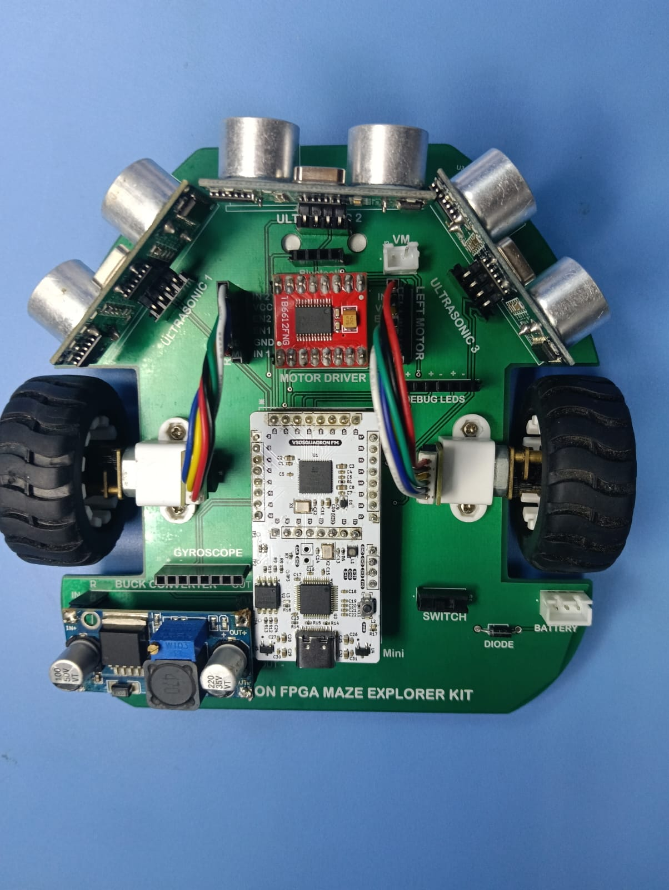
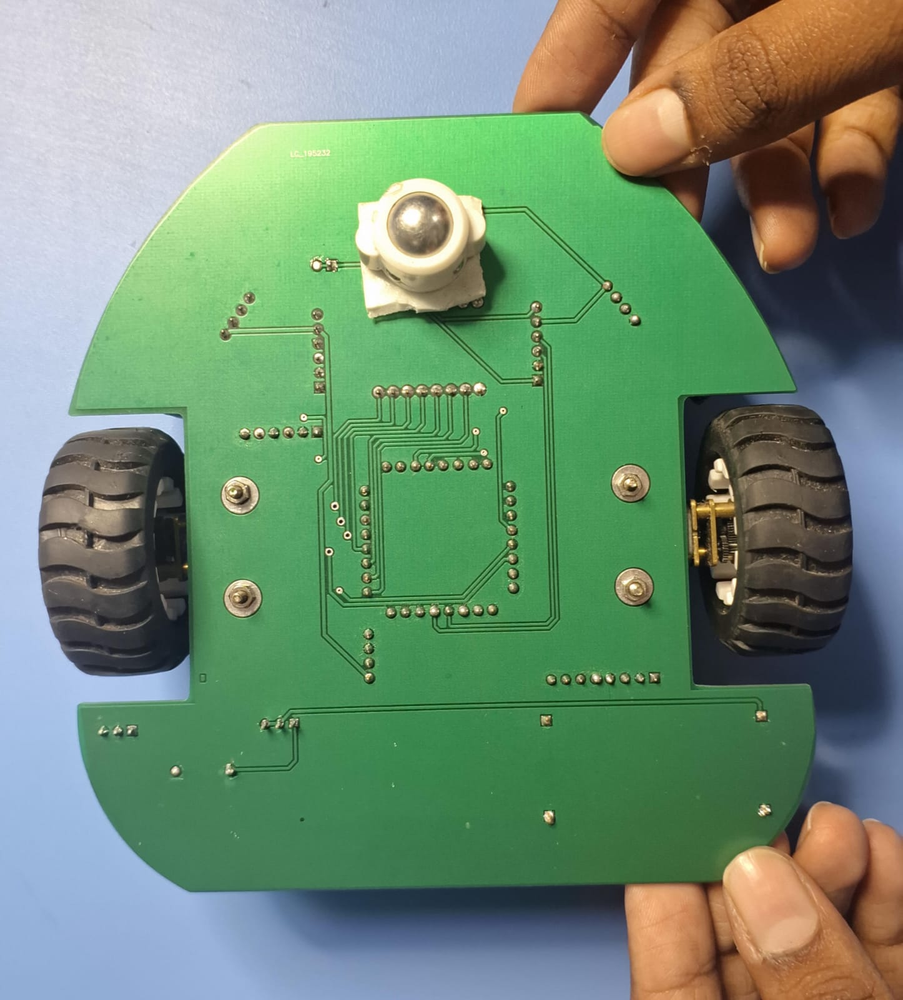
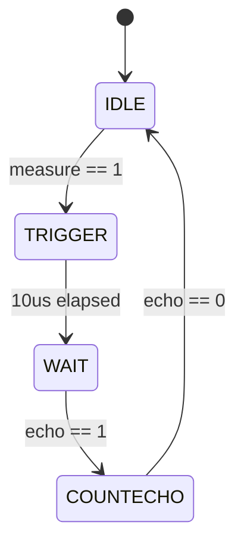
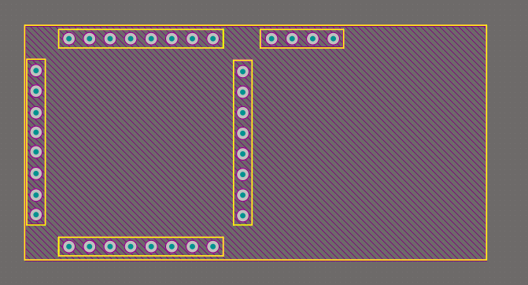
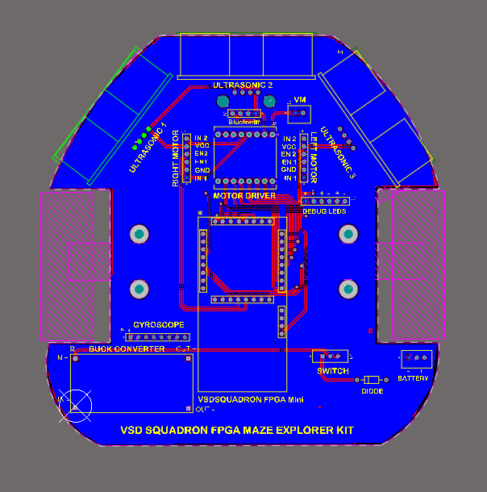
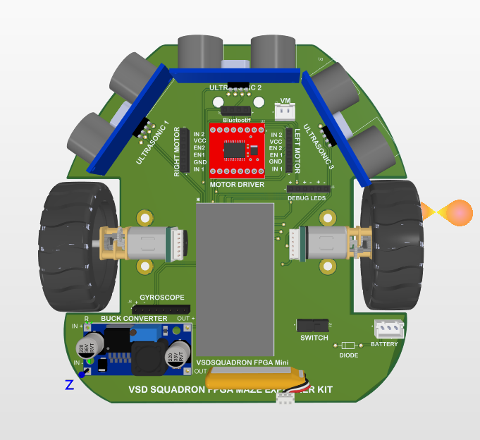

# 🏰 VSD Squadron School Version - Technical Whitepaper & Git Repo

This repository serves as a comprehensive engineering showcase for a Micromouse robot built around the **VSD Squadron FM FPGA**. It transitions from high-level architectural concepts to bit-precise RTL implementation and high-fidelity PCB design.

---

## 📸 Media & Process Gallery

### 🤖 The Fabricated Robot
|  |  |
| :---: | :---: |
| *Front View: Sensor Array & Chassis* | *Back View: Motor Drivers & Power* |

### 🎬 Performance Validation
| [Maze Navigation 1](media/mazefirst.mp4) | [Maze Navigation 2](media/maze2.mp4) |
| :---: | :---: |

---

## ⚡ RTL Architecture Deep-Dive

The system logic is implemented in **Verilog HDL**, optimized for the **Lattice iCE40** fabric found on the VSD Squadron FM.

### 1. Ultrasonic Ranging Core (`ultra_sonic_sensor.v`)
The ranging core operates as a synchronous state machine clocked at 12MHz.

#### 🛰️ State Machine Analysis (FSM)

- **IDLE (2'b00)**: Waiting for the `measure` pulse from the `refresher250ms` module.
- **TRIGGER (2'b01)**: Asserting the `trig` pin. The `parameter ten_us = 10'd120` ensures an exact 10µs pulse (120 cycles @ 12MHz).
- **WAIT (2'b11)**: Synchronization state waiting for the HC-SR04 driver to initiate the ultrasonic burst.
- **COUNTECHO (2'b10)**: The core timing loop. `distanceRAW` increments every clock cycle while `echo` is high.

#### 📐 Precision Ranging Math
To convert raw cycles into centimeters without floating-point hardware:
$$Distance(cm) = \frac{Cycles \times 34300 \frac{cm}{s}}{2 \times 12,000,000 \frac{cycles}{s}}$$
This is implemented using high-precision fixed-point multiplication before the division to maintain accuracy.

### 2. UART Telemetry Interface (`uart_trx.v`)
An **8N1 (8 data bits, No parity, 1 stop bit)** transmitter for real-time telemetry.

- **Baud Rate Generation**: The module expects a baud-aligned clock (9600Hz).
- **State Transition**:
  1. `STARTTX`: Pulls line LOW.
  2. `TXING`: Iterates through `buf_tx[7:0]` using a bit counter.
  3. `TXDONE`: Drives line HIGH (Idle/Stop) for 1 bit period.

---

## 🚥 Hardware Engineering & PCB Design

### 1. The VSD Squadron FM Footprint
Designing the footprint required sub-millimeter precision to accommodate the 36-pin DIP-style FPGA module.
- **Pitch**: 2.54mm (100 mil) standard header.
- **Span**: Optimized for a 600 mil row-to-row spacing.
- **Via Design**: 0.9mm drill size for robust mechanical mounting and ease of hand-soldering.



### 2. Schematic Rationale
- **Power Tree**: A dual-rail supply system. The Li-ion battery (7.4V) is regulated down to **5V** for the Ultrasonic sensors and then further to **3.3V** for the FPGA core and logic.
- **Level Shifting**: The HC-SR04 ECHO pulse is 5V, while the iCE40 I/Os are 3.3V. A simple voltage divider (1kΩ/2kΩ) is utilized to ensure signal integrity without damaging the FPGA fabric.

| 2D Design | 3D Visualization |
| :---: | :---: |
|  |  |

---

## 🛠️ Toolchain & Deployment Guide

This project leverages the open-source **IceStorm** toolchain for a streamlined "Code-to-Bitstream" workflow.

### 1. Synthesis & PnR Flow
1. **Synthesis**: `yosys -p "synth_ice40 -top top_module -json project.json" rtl/*.v`
2. **Place & Route**: `nextpnr-ice40 --lp8k --package cm81 --json project.json --pcf rtl/VSDSquadronFM.pcf --asc project.asc`
3. **Bitstream**: `icepack project.asc project.bin`
4. **Flash**: `iceprog project.bin`

### 2. Physical Constraints (`.pcf`)
The `.pcf` file is the bridge between the logic and the PCB.
```pcf
set_io hw_clk 20       # 12MHz On-board Osc
set_io echo1 2         # Front Ultrasonic Echo
set_io trig1 3         # Front Ultrasonic Trig
set_io AIN1 19         # Left Motor Dir A
set_io PWMA 31         # Left Motor Speed
```

---

## 🎓 Conclusion
This Micromouse implementation stands as a testament to the versatility of the **VSD Squadron FM**. By offloading time-critical sensing and motor control to dedicated RTL blocks, we achieve microsecond-level responsiveness that is unattainable with standard microcontrollers.

**Developed by**: Gowtham  
**Platform**: VSD Squadron FM (iCE40-based)
